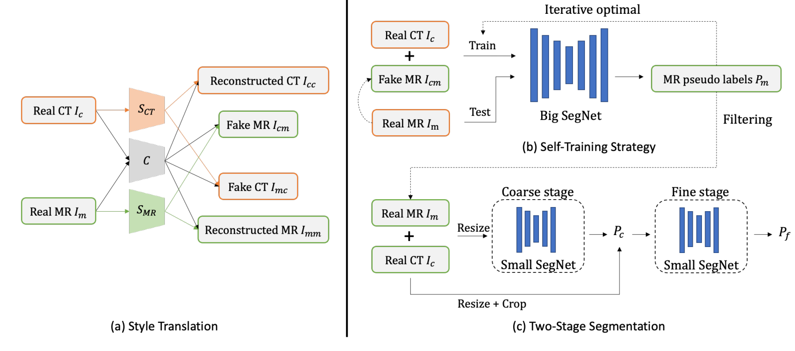

# 🔥 FLARE24 Solution

This repository is the official implementation of [A 3D Unsupervised Domain Adaption Framework Combining Style Translation and Self-Training for Abdominal Organs Segmentation](https://openreview.net/forum?id=oSbUYnIDs9&referrer=%5BAuthor%20Console%5D(%2Fgroup%3Fid%3DMICCAI.org%2F2024%2FChallenge%2FFLARE%2FAuthors%23your-submissions)) of Team tju_vil_pioneers on FLARE24 challenge.

## 🔍 Overview
This work addresses the challenge of adapting CT-trained segmentation models to MR images by generating synthetic MR data, employing self-training strategies, and a two-stage segmentation framework in the FLARE24 dataset. For more details, see the pipeline diagram below:

<div align=center>

</div>

## ⚙️ Environments and Requirements
* Ubuntu 20.04.6 LTS
* Intel(R) Xeon(R) Platinum 8153 CPU @ 2.00GHz, RAM 192GB , NVIDIA Tesla V100 (32G)
* CUDA >= 11.3
* python >= 3.7.13

To set up the environment, follow these steps:

```
conda create -n FLARE24 python=3.7.13
conda activate FLARE24
pip install -r requirements.txt
```
> PS: You should install torch==1.12.0+cu113 before pip install requirements.
```
pip install torch==1.12.0+cu113 --extra-index-url https://download.pytorch.org/whl/cu113
```
## 💾 Dataset
The training Data and validation data are provided by the [FLARE24](https://www.codabench.org/competitions/2296/). In short, there are 2300 partial labeled CT and 4000+ unlabeled MR data for training, 110 public cases for validation and 300 hidden cases for the final test. 

The CT scans are from the FLARE 2022 dataset where 50 cases have ground-truth labels and the remaining cases have pseudo labels (generated by the FLARE 2022 winning solution, ~90% DSC score). 

1.CT scans need to be manually adjusted, placing the 2000 pseudo-labeled and 300 manually labeled data into the corresponding folders under the CT directory.

2.The two MR datasets 'AMOS_MR_good_spacing-833' and 'LLD-MMRI-3984' should both be placed under the MR/Training directory.
```
|-- datasets
|   |-- CT
|   |   |-- CT2MR_image
|   |   |-- CT_image
|   |   `-- CT_label
|   |-- MR
|   |   |-- PublicValidation
|   |   |   |-- imagesVal
|   |   |   `-- labelsVal
|   |   `-- Training
|   |       |-- AMOS_MR_good_spacing-833
|   |       |-- LLD-MMRI-3984
|   |       |-- PLabel
|   |       |-- PLabel_image
|   |       |-- preprocess_data_pair
|   |       `-- regis_data
|   |-- processed_data
|   |   |-- coarse
|   |   |   |-- combined_data
|   |   |   `-- small_segnet
|   |   `-- fine
|   |       |-- big_segnet
|   |       |-- combined_data
|   |       `-- small_segnet
|   `-- static_info
```

## 🪄 Preprocessing

We have included multiple preprocessing steps based on the model training phase.
For the first phase, we only use CT data and domain transfer data.

For Step 1 Domain Translation
```
Domain Translation code will comming soon

# For original CT images, you can use the following command for data preprocessing (for images after domain transfer, refer to the config to modify the path for data preprocessing)

python ./preprocess/data_preprocess.py --cfg ./configs/preprocess/preprocess_step1_CT.yaml
```
For Step 2 self-Training Strategy and Step 3 Two-Stage Segmentation preprocess model trained data.
It includes pseudo label generation, registration, data filtering, and data preprocessing.
```
python ./preprocess/data_preprocess.py --cfg ./configs/preprocess/preprocess_step2_amos.yaml

python ./preprocess/data_preprocess.py --cfg ./configs/preprocess/preprocess_step2_lld.yaml
```
Now you can train your models.

# 🖥️ Train

1. Training our model consists of several main steps, as depicted in the pipeline figure above. Follow these instructions to conduct the training process effectively:

### Step 1: Training Domin transfer

- Train stage one image-to-image translation model for style transfer
```bash
python stage_1_i2i_train.py --name sourceAtotargetB
```
- Generate target-like source domain images
```bash
python stage_1.5_i2i_inference.py --ckpt_path YOUR_PATH --source_npy_dirpath SOURCE_PATH --target_npy_dirpath TARGET_PATH --save_npy_dirpath SAVE_PATH --k_means_clusters 6
```

### Step 2: Training Big SegNet

```bash
python train.py --cfg ./configs/train/train_big_segnet.yaml
```

### Step 3: Training Small SegNet

```bash
# coarse stage
python train.py --cfg train_small_segnet_coarse_stage.yaml
# fine stage
python train.py --cfg train_small_segnet_fine_stage.yaml
```


#### You can download trained models here:
[BaiduNetDisk](https://pan.baidu.com/s/1oPLEmcTFZxjvTHijNW8Byg?pwd=67vi)

2. To fine-tune the model on a customized dataset, run this command: An example of small_segnet_fine_stage

```bash
python train.py --cfg train_small_segnet_fine_stage_fintune.yaml
```

## 🗳️ Inference

To infer the testing cases, run this command:
An experiment of small segnet

```bash
python inference.py --cfg ./configs/inference/inference_small_segnet.yaml 
```

## 📊 Evaluation

To compute the evaluation metrics, run:

```eval
python eval.py --cfg ./configs/eval/eval_small_segnet.yaml
```

## 📋 Results

Our method achieves the following performance on [FLARE24](https://www.codabench.org/competitions/2296/)

| Dataset Name       | DSC(%) | NSD(%) |
|--------------------|:------:|:------:|
| Validation Dataset | 79.42% | 86.46% |
| Test Dataset       |   ?    |   ？    |

## 🎆 Contributing
This project is licensed under the [Apache License 2.0](LICENSE), and please adhere to the licenses of the models and datasets used.

## 🙏 Acknowledgement

 We thank the contributors of [FLARE24 datasets](https://www.codabench.org/competitions/2296/).
